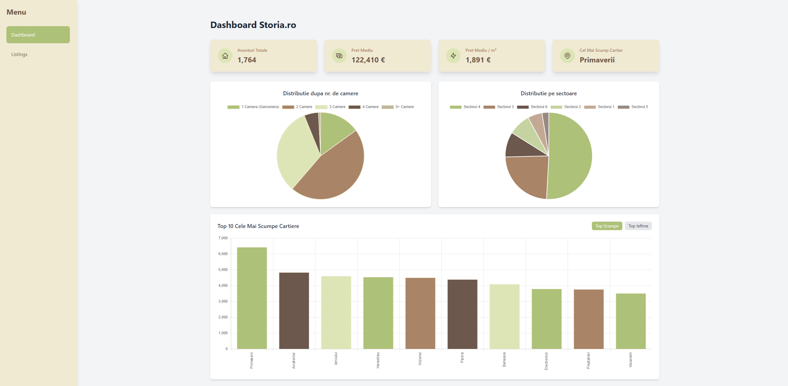

# 🏠 Real Estate Market Analyzer

### A full-stack, end-to-end data engineering portfolio project demonstrating the complete data lifecycle: from automated web scraping and orchestration to cloud data warehousing, transformation, and interactive visualization.

**✨ Live Demo:** **[storia-dashboard.vercel.app](https://storia-dashboard.vercel.app/)**

---

## Key Features

*   **Automated Daily Ingestion:** An Airflow DAG scrapes new real estate listings from Storia.ro every day.
*   **Cloud-Native Architecture:** Utilizes Azure for raw data storage and Snowflake for high-performance analytics.
*   **Robust Data Transformation:** dbt models clean, transform, and test the data, ensuring quality and consistency.
*   **Interactive Dashboard:** A modern React frontend with Tailwind CSS allows users to filter, sort, and visualize data through dynamic charts and tables.
*   **Performance Optimized API:** A Node.js backend serves data from Snowflake with an in-memory caching layer to ensure a fast user experience and minimize costs.



---

## ⚙️ Technology Stack & Architecture

This project is built on a modern data stack, separating responsibilities across an ELT (Extract, Load, Transform) workflow.

### Tech Badges


### Architecture Diagram


### Data Flow

1.  **Orchestration (Airflow):** A Dockerized Apache Airflow DAG runs on a daily schedule.
2.  **Extraction (Python):** The DAG executes a Python script that scrapes new listings from `storia.ro` using `requests` and `BeautifulSoup`.
3.  **Cloud Ingestion (Azure):** Raw data is uploaded as daily CSV files to an **Azure Blob Storage** container, acting as a data lake/staging area.
4.  **Data Warehouse Loading (Snowflake):** The raw CSVs are loaded into a staging table in **Snowflake**.
5.  **Transformation (dbt):** dbt SQL models transform the raw data—cleaning fields, casting data types, and adding business logic (e.g., price per square meter). The final, clean data is materialized into an analytics-ready table (`dim_listings`).
6.  **Backend API (Node.js):** A RESTful API built with **Express.js** queries the clean data from Snowflake and exposes it through various endpoints.
7.  **Frontend Dashboard (React):** A single-page application built with **React**, **TypeScript**, and **Vite** consumes the API data and presents it through interactive KPI cards, charts, and a filterable table, styled with **Tailwind CSS**.

---

## 🚀 Key Learnings & Technical Challenges

This project provided deep insights into the practical challenges of building a data pipeline.

*   **Anti-Scraping Measures:** An initial attempt on a different portal failed due to advanced anti-bot protections. The solution was to **pivot** to a more accessible source (`storia.ro`) and implement **request delays** to ensure reliable extraction.
*   **Secrets Management in Airflow:** Passing the Azure Connection String to a `BashOperator` was challenging. The final, robust solution involved using a `Generic` Airflow connection and injecting the secret as an environment variable directly into the `bash` command, ensuring both security and functionality.
*   **Performance Optimization:** Initial frontend load times were slow due to direct queries to Snowflake on every filter change. An **in-memory caching layer** (`node-cache`) was implemented in the Node.js API, reducing response times for repeated requests from seconds to milliseconds and minimizing Snowflake warehouse costs.

---

## Local Development

To run the entire system locally, follow the steps below.

### Prerequisites
*   Docker Desktop
*   Node.js (via `nvm` is recommended)
*   Python & a virtual environment tool
*   Active accounts on Microsoft Azure and Snowflake

# 🏠 Real Estate Market Analyzer

### A full-stack, end-to-end data engineering portfolio project demonstrating the complete data lifecycle: from automated web scraping and orchestration to cloud data warehousing, transformation, and interactive visualization.

**✨ Live Demo:** **[storia-dashboard.vercel.app](https://storia-dashboard.vercel.app/)**

---

## Key Features

*   **Automated Daily Ingestion:** An Airflow DAG scrapes new real estate listings from Storia.ro every day.
*   **Cloud-Native Architecture:** Utilizes Azure for raw data storage and Snowflake for high-performance analytics.
*   **Robust Data Transformation:** dbt models clean, transform, and test the data, ensuring quality and consistency.
*   **Interactive Dashboard:** A modern React frontend with Tailwind CSS allows users to filter, sort, and visualize data through dynamic charts and tables.
*   **Performance Optimized API:** A Node.js backend serves data from Snowflake with an in-memory caching layer to ensure a fast user experience and minimize costs.


---

## ⚙️ Technology Stack & Architecture

This project is built on a modern data stack, separating responsibilities across an ELT (Extract, Load, Transform) workflow.

### Tech Badges


### Architecture Diagram


### Data Flow

1.  **Orchestration (Airflow):** A Dockerized Apache Airflow DAG runs on a daily schedule.
2.  **Extraction (Python):** The DAG executes a Python script that scrapes new listings from `storia.ro` using `requests` and `BeautifulSoup`.
3.  **Cloud Ingestion (Azure):** Raw data is uploaded as daily CSV files to an **Azure Blob Storage** container, acting as a data lake/staging area.
4.  **Data Warehouse Loading (Snowflake):** The raw CSVs are loaded into a staging table in **Snowflake**.
5.  **Transformation (dbt):** dbt SQL models transform the raw data—cleaning fields, casting data types, and adding business logic (e.g., price per square meter). The final, clean data is materialized into an analytics-ready table (`dim_listings`).
6.  **Backend API (Node.js):** A RESTful API built with **Express.js** queries the clean data from Snowflake and exposes it through various endpoints.
7.  **Frontend Dashboard (React):** A single-page application built with **React**, **TypeScript**, and **Vite** consumes the API data and presents it through interactive KPI cards, charts, and a filterable table, styled with **Tailwind CSS**.

---

## 🚀 Key Learnings & Technical Challenges

This project provided deep insights into the practical challenges of building a data pipeline.

*   **Anti-Scraping Measures:** An initial attempt on a different portal failed due to advanced anti-bot protections. The solution was to **pivot** to a more accessible source (`storia.ro`) and implement **request delays** to ensure reliable extraction.
*   **Secrets Management in Airflow:** Passing the Azure Connection String to a `BashOperator` was challenging. The final, robust solution involved using a `Generic` Airflow connection and injecting the secret as an environment variable directly into the `bash` command, ensuring both security and functionality.
*   **Performance Optimization:** Initial frontend load times were slow due to direct queries to Snowflake on every filter change. An **in-memory caching layer** (`node-cache`) was implemented in the Node.js API, reducing response times for repeated requests from seconds to milliseconds and minimizing Snowflake warehouse costs.

---

## Local Development

To run the entire system locally, follow the steps below.

### Prerequisites
*   Docker Desktop
*   Node.js (via `nvm` is recommended)
*   Python & a virtual environment tool
*   Active accounts on Microsoft Azure and Snowflake


### 1. Backend API
```bash
cd backend_api
# Create a .env file and add your Snowflake credentials
npm install
npm run dev
```

### 2. Frontend Dashboard
```bash
cd frontend_dashboard
# Create a .env file and add VITE_API_BASE_URL=http://localhost:3001
yarn install
yarn dev
```

### 3. Data Pipeline (Airflow)
```bash
cd proiect-airflow
# Make sure Docker Desktop is running
docker-compose up
```
*Access `http://localhost:8080` and manually trigger the `storia_daily_data_ingestion` DAG.*

### 4. Transformations (dbt)
```bash
cd imobiliare_transforms
# Make sure your ~/.dbt/profiles.yml file is configured correctly
dbt run
